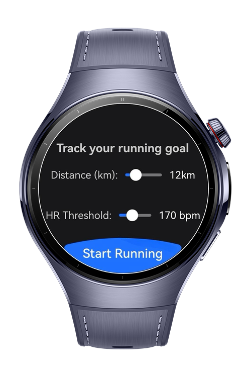
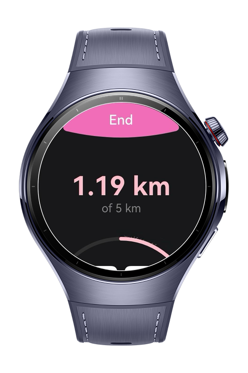
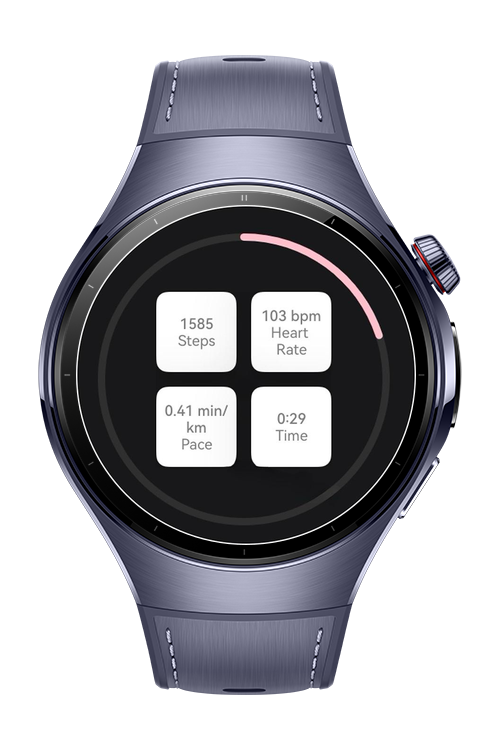
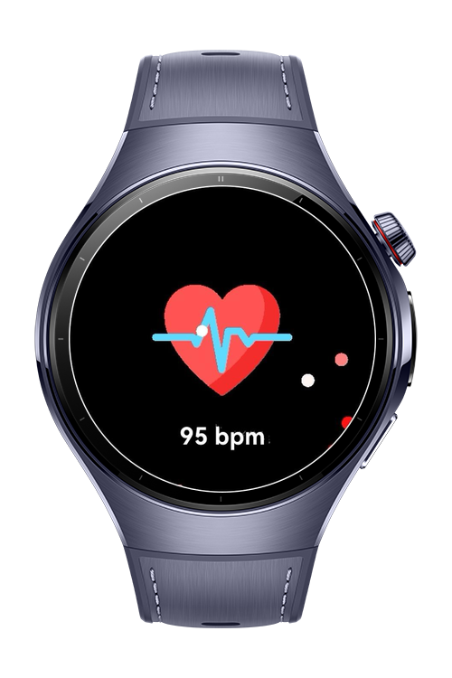

> **Note:** To access all shared projects, get information about environment setup, and view other guides, please visit [Explore-In-HMOS-Wearable Index](https://github.com/Explore-In-HMOS-Wearable/hmos-index).

# Pace Pulse

This is a comprehensive fitness tracking application for running activities, built with ArkTS and ArkUI with advanced sensor integration and real-time health monitoring features, designed for HarmonyOS NEXT wearable devices. It leverages SensorKit for pedometer and heart rate monitoring with optimized circular screen support with lottie animations.

# Preview

<div>




</div>

# Use Cases

This demo application provides:
- Set personalized running goals with customizable distance targets and heart rate thresholds.
- Track running metrics in real-time including step count, distance covered, pace, and duration
- Receive haptic feedback at each kilometer milestone during the running session.
- Monitor heart rate continuously with automatic safety alerts when exceeding user-defined thresholds.
- Navigate seamlessly between running interface and health alerts based on real-time biometric data.
- Ensure user safety with automatic session management and visual/audible warnings for elevated heart rates.


# Technology

## Stack

- Languages: ArkTS (Ark TypeScript)

- Frameworks: Requires **DevEco Studio** (e.g. version 5.1.0.842)

- Tools: Requires **DevEco Studio** (e.g. version 5.1.0.842).

- Libraries & Kits:

- `@kit.SensorServiceKit`
- `@kit.AbilityKit`
- `@kit.BasicServicesKit`
- `@kit.ArkUI`
- `@ohos.router`
- `@ohos/lottie`

## Required Permissions
- ohos.permission.READ_HEALTH_DATA
- ohos.permission.ACTIVITY_MOTION
- ohos.permission.VIBRATE

# Directory Structure

```
entry/src/main/ets/
ets/
│
├── common/
│   └── Constants.ets
│
│── components/
│   ├── LiveMetricsComponent.ets
│   └── MetricCard.ets
│ 
├── entryability/
│   └── EntryAbility.ets
│
├── entrybackupability/
│   └── EntryBackupAbility.ets
│
├── models/
│   └── RunModels.ets
│
├── pages/
│   ├── HeartRateAlertPage.ets
│   ├── MainPage.ets
│   ├── RunningPage.ets
│   └── StartPage.ets
│
├── services/
│   ├── HeartRateService.ets
│   ├── PedometerService.ets
│   └── VibrationService.ets
│
├── utils/
│   └── PermissionManager.ets
│
├── viewmodels/
│   └── RunViewModel.ets
│
resources/


```

# Constraints and Restrictions

## Supported Device
- Huawei Watch 5

# License

Pace Pulse is distributed under the terms of the MIT License
See the [LICENSE](./LICENSE) for more information.


